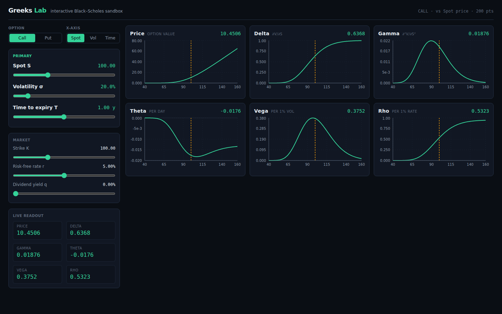

# Greeks Lab

An interactive Black–Scholes options sandbox. Drag sliders for spot, volatility and
time to expiry and watch the option price and its Greeks (delta, gamma, theta, vega,
rho) reshape in real time. Built for building intuition about how the Greeks move.

**🔗 Live demo: [wei-chen-7.github.io/Greeks-Lab](https://wei-chen-7.github.io/Greeks-Lab/)**



## Stack

- **React + TypeScript + Vite** (scaffolded from the Vite `react-ts` template)
- **Recharts** for the line charts
- **Tailwind CSS v4** for layout/styling
- **Vitest** for unit tests
- **No finance/math libraries** — Black–Scholes and every Greek are implemented by
  hand, fully client-side (no backend).

## Run it

```bash
npm install
npm run dev        # start the dev server (http://localhost:5173)
npm test           # run the math unit tests
npm run build      # type-check + production build
npm run lint       # oxlint
```

## How it works

### The math (`src/math/`)

- **`normal.ts`** — the standard normal PDF `phi(x)` and CDF `N(x)`. JS has no
  built-in `erf`/normal CDF, so `N(x)` is built on the Abramowitz & Stegun 7.1.26
  approximation of `erf` (max abs error ~1.5e-7) via `N(x) = ½(1 + erf(x/√2))`.
- **`blackScholes.ts`** — price + all Greeks for European calls and puts with a
  continuous dividend yield `q`. `toDisplayGreeks` applies the trader-facing display
  conventions (theta per day, vega/rho per 1%).

```
d1 = (ln(S/K) + (r - q + σ²/2)·T) / (σ·√T)
d2 = d1 - σ·√T
```

Edge cases are guarded: `T`, `σ`, `S` and `K` are clamped to a tiny floor (`1e-6`)
so `d1`/`d2` can't blow up to `NaN`/`Infinity` near expiry or zero vol.

The CDF and the pricing/Greeks are verified against known values in
`*.test.ts` — `N(0)=0.5`, `N(1.96)≈0.975`, the canonical `S=K=100, T=1, σ=20%,
r=5%` call (`10.4506`) and put (`5.5735`), put–call parity, and the
`Δcall − Δput = e^{-qT}` identity — so the Greeks aren't subtly wrong.

### The app (`src/`)

- **`lib/types.ts`** — shared strict types (`Params`, `MetricKey`, `AxisKey`, …).
- **`lib/metrics.ts`** — display metadata (labels, precision) and axis definitions,
  shared by every component.
- **`lib/series.ts`** — sweeps the chosen x-axis variable across a sensible range
  (~200 points) and computes every metric at each point. One sweep feeds all charts.
- **`components/`** — `Controls` (sliders + toggles), `GreekChart` (reusable,
  memoized, animation off for instant redraws), `ReadoutPanel`, `ChartGrid`,
  plus small `SliderRow` / `Segmented` primitives.
- **`App.tsx`** — holds parameter state and memoizes the heavy compute so dragging
  stays smooth.

## Features

**Core**

- Sliders for spot `S`, volatility `σ` (%), and time to expiry `T` (years) — the
  stars — plus strike `K`, risk-free rate `r`, and a Call/Put toggle.
- A responsive grid of small line charts (Price, Delta, Gamma, Theta, Vega, Rho)
  plotted against spot price, each with a vertical reference line at the current spot.
- A live numeric readout of the price and each Greek at the current parameters,
  using the display conventions.
- Everything recomputes live and smoothly while dragging any slider.

**Stretch (implemented)**

- A dividend-yield `q` slider.
- An x-axis switch so each Greek can be viewed as a function of **Spot**,
  **Volatility**, or **Time to expiry**. The chart range widens automatically so the
  current-value marker always stays in view.
- A **two-leg vertical spread**: a second strike `K₂` and a Single/Spread toggle.
  In spread mode the charts show the combined (long `K₁` / short `K₂`) position
  Greeks — the capped-payoff price curve, sign-flipping gamma/vega between the
  strikes, etc. — with faint reference lines at both strikes. Works for call or put
  verticals; placing `K₂` above or below `K₁` gives a bull or bear spread.

**Possible next steps**

- Arbitrary multi-leg positions (straddles, butterflies, custom quantities).
